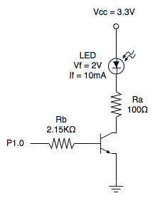

# Multiple Blink

On all microprocessors except for the MSP430F5529, two LEDs blink at different rates. LED2 blinks at two times the frequency of LED1. On the F5529, the LED blinking sequence has a "ping pong" effect where the light appears to "bounce" left to right and back.

## Implementation

Much of the work here is similar to the work done in Simple Blink, including defining variables for macros, stopping the watchdog timer, disabling the default GPIO mode, and setting up the registers. The purpose of this exercise is to show that the pins are multifunctional. Multiple pins can be set up as I/O pins to control multiple LEDs.

### MSP430F5529

The main difference here is the MSP430F5529 which uses a finite state machine -- implemented by a switch statement -- to control the LED blinking sequence. Two unsigned integers, <code>state</code> and <code>ns</code> (next state) are used to control the state machine. Each case in the switch statement is a state in the FSM. The next state is set in each case statement. In the final case, the value of <code>ns</code> is set to 0, which signals a return to the beginning of the FSM.

For each state, an LED is switched off and the LED directly next to it is switched on. When building this project, I used a breadboard with two extra LED circuits. The design for the circuit I built can be seen in the figure. 

I had to flip the board over to access the ports on the bottom of the F5529. So, the light pattern starts with LED2, which is now on the left of LED1, then moves to LED1. LED3 and LED4 are the off-board LEDs. Once the light reaches LED 4 (the rightmost one) it bounces back in the opposite direction towards LED2. Again, this is all controlled by the FSM.